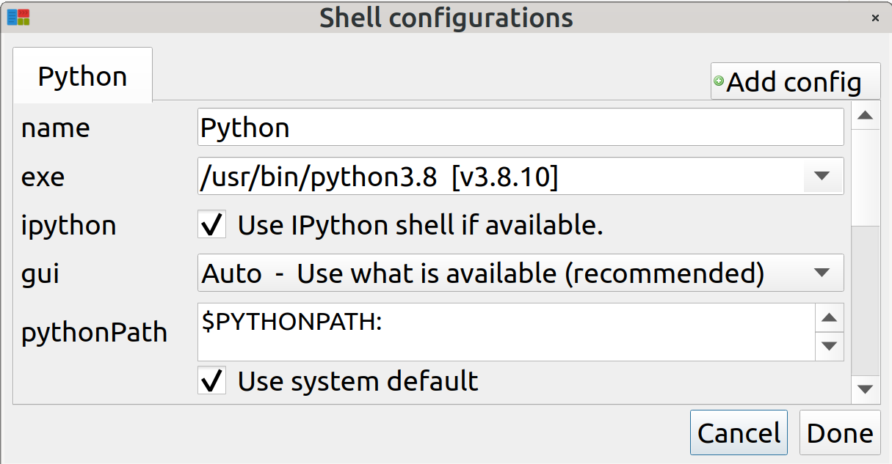
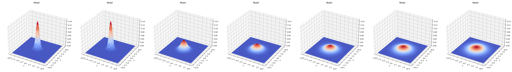

__The Place__

What is a caveman? An announced and prominent trend in usage and development in the Jupyter ecosphere is to exert leverage toward Jupyterlab, which is undoubtedly a strong and popular product. Nevertheless, some 'paleo', even 'neanderthal', individuals stick stubbornly to the classic notebook. Similar to a caveman role. Just call me Mr. Neanderthal.
   
The purpose of this repository is twofold: One, to show how to set up a purely classical notebook environment, and Two, to show how to run the demo problem from __vmc_pde__  in order to appreciate an important recent approach to partial differential equation solving.

__The Distro__

Why use Mint 20.2 ? For the Jaxlib version that will be required, 1.7.4, the only available Python wheels will be for Python 3.7, 3.8, and 3.9. Mint 20.2 inherits from Ubuntu 20.04, which ships Python 3.8.2 as default. Perhaps there is a distro out there somewhere that ships with Python 3.9, but for now, Mint 20.2 will do.

__Download It__

Download Mint 20.2 XFCE version. The downloaded iso is about 1.9 GB in size.

__Install It__or__Etch It__

The iso can be installed as either a virtual machine _a la_ Virtual Box, or as an independent drive. If it is to be installed as an independent bootable distro, then Balena Etcher writes the iso to a bootable executable on a SD chip. If destined for a virtual machine, it should be left as a non-bootable .iso file. (Both paths described were verified.)

__Run It__

Once the distro is running, you can add some preferred applications if desired, such as Mousepad, PCManFM, or Synaptic. The included browser does not meet current Github standards, so download a fresh copy of Firefox or other and extract it in the Downloads directory. Using the new browser, download the Github code from both repositories: whiffee/Jupyter_caveman and RehMoritz/vmc_pde, and extract them.

__Install pip__

If you invoke pip in a terminal, advice about the correct syntax for its installation will appear. As a package manager, pip comes with some baggage, and takes a little time to get installed. When dealing with an older Linux distro, things can go wrong, like not being able to install pip. If this happens, see the pip-related snippet in the file _terminal\_snippets_.

__Install the Python Framework__

In Linux you can open a directory by right clicking it and choosing 'Open in Terminal'. Open the caveman directory in a terminal. You can type _'ls'_ to view the directory contents. Then run the installation command shown below, the one regarding requirements.txt. During the ensuing installations, there shouldn't be a hiccup, but if there is, the requirements.txt file can be edited to solve the issue, and the execution can be re-run.

__Make a Freeze List__

After the installations are complete, you can do a sanity check on the freeze list. Notice that there are no lines in the list for Jupyterlab or Jupyterlab_server.

__Install jaxlib__

The __vmc_pde__ instruction notes specify to use jaxlib version 1.7.4. (Not that it matters, I found that version 1.7.5 is also usable.) Notice that among numerical version siblings, pip will choose the file which matches Python 3.8. Because the pip-accessible file database does not contain the desired version of jaxlib, pip has to install from a secondary source. A text file with the address in selectable format is contained in the _terminal\_snippets_ file and the address also appears in the image below. As for the red text warnings shown, the stated non-compatibility does not actually exist; in fact the goal of the whole versioning exercise is to deliver compatibility, which it successfully does.

 

__Install mpi4py__

If the module mpi4py is included in the requirements.txt list, it will install smoothly initially, but it will get kicked out later, before the end of the installation fest, and in such a way that it can't be re-installed directly. I took a hint from Stack Overflow question 28440834 to dodge this _contretemps_, first installing the dev version of Open MPI, and then installing mpi4py without specifying a desired version. (It installed version 4.0.3).

__Install the Python IDE Pyzo__

To get a quick look at the viability of the code execution machinery, use apt to install the Pyzo program; then configure the shell with logical defaults.

__Test the Sample Code__

Directly test the sample problem using Pyzo. Open the main.py module, located within the __vmc_fluids__ directory, and run it. The data, tables, and all 19 figures should be generated. After having demonstrated that the code is viable, you can move on to testing the functionality of the Jupyter version.

__Edit the PATH__

In the home directory there is a file called .bashrc. It is necessary to edit this file to get permanent effective change in the $PATH. The permanent change that is desired is access to some designated import directory, which can hold the modules that the application will need to import as ancillaries. At the very end of the file place a $PATH change statement similar to the one shown on the last line of the image below.

After saving the change to .bashrc, it is necessary to reboot the computer to incorporate the change. If you forget to do this, then the first time you try to launch Jupyter with the command _jupyter notebook_, the terminal will offer to install Jupyter.

__Test Jupyter Rendition__

The target directory that was the subject of the $PATH statement in the .bashrc file should be augmented to contain the 14 .py files that are located in the __vmc_fluids__ directory of the __vmc_pde__ code folder, plus a sample notebook file with a cell containing the main.py code. Right click on this target directory, open a terminal, and launch the Jupyter notebook from there, using the launch command <jupyter notebook>. Open a notebook file and execute the critical cell. All the output for the sample problem that was shown in Pyzo should show up in the Jupyter output.

clipart credit to Jean Beaufort (publicdomainpictures.net)

Page last updated on 13 May 2025

  
