__The Place__

What is a caveman? An announced and prominent trend in usage and development in the Jupyter ecosphere is to exert leverage toward Jupyterlab, which is undoubtedly a strong and popular product. Nevertheless, some 'paleo', even 'neanderthal', individuals stick stubbornly to the classic notebook. Similar to a caveman role. Just call me Mr. Neanderthal.
   
The purpose of this repository is twofold: One, to show how to set up a purely classical notebook environment, and Two, to show how to run the demo problem from __vmc_pde__  in order to appreciate an important recent approach to partial differential equation solving.

__The Distro__

Why use Mint 20.2 ? For the Jaxlib version that will be required, 1.7.4, the only available Python wheels will be for Python 7, 8, and 9. From Python 9 experience, I can say that all is fine with Python 3.9 for this project, but to keep things simple I wanted to utilize native Python in whatever distro was chosen. As a policy decision, Mint (or more probably Ubuntu) restricts the installed Python sub-versions to even numbers. This makes 20.2 the natural choice, since it ships with Python 3.8.10, the highest version number available in Mint which is less than 3.10.

__Download It__

Download Mint 20.2 XFCE version. The downloaded iso is about 1.9 GB in size.

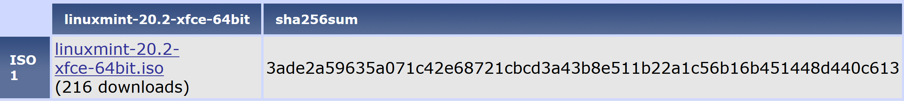

__Etch It__

Balena Etcher writes the iso to a bootable executable on a SD chip.

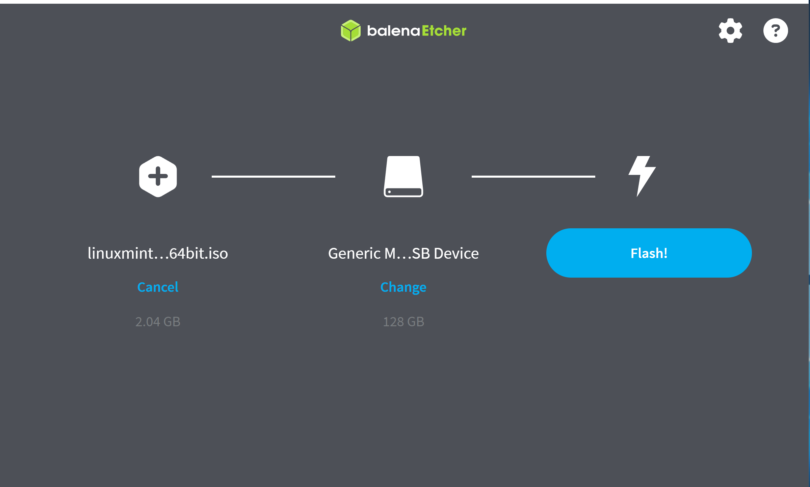

__Install It__

The iso can be installed as either a virtual machine _a la_ Virtual Box, or as an independent drive. I made three test runs with a dedicated SSD to validate the procedure outlined here.

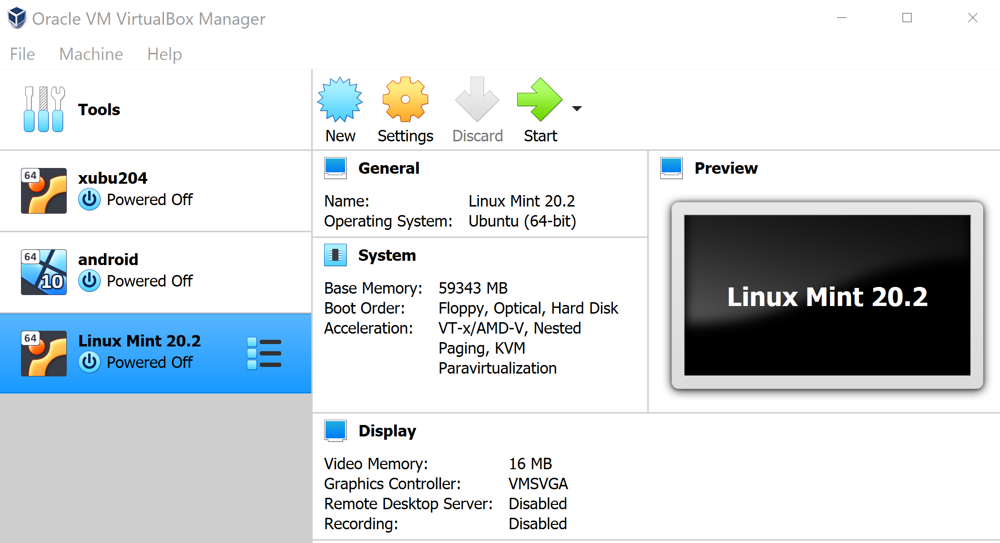

__Run It__

Once the distro is running, you can add some preferred applications if desired, such as Mousepad, PCManFM, or Synaptic. When a basic toolset is in place, download the code from the caveman repository and extract it in the Downloads directory.

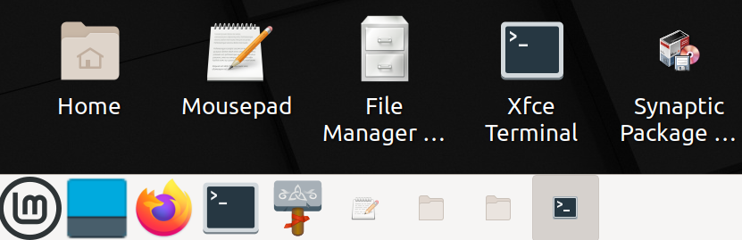

__Install the Python Framework__

Right click the extracted caveman directory and open it in a terminal. You can type _ls_ to view the directory contents. Then run the installation command shown below, the one regarding requirements.txt. It's actually pretty neat that pip can install any number of modules named in a text list, meanwhile ensuring that the exact version you specify is installed in each case. If there happens to be a hiccup, pip will stop the process with red error msgs. In this case, the requirements.txt file can be edited to solve the issue, and the execution can be re-run.

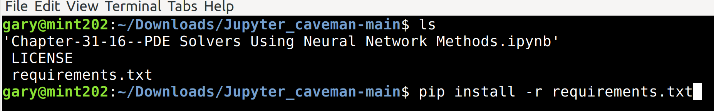

__Make a Freeze List__

After the installations are complete, you can do a sanity check on the freeze list. Notice that there are no lines in the list for Jupyterlab or Jupyterlab_server.

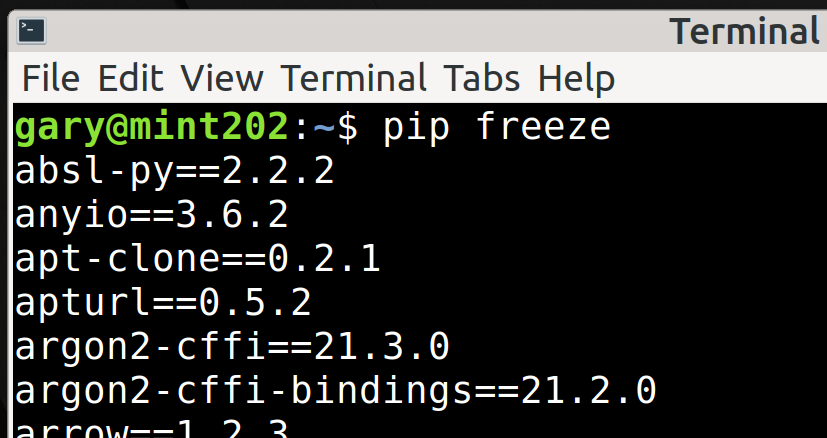

__Install jaxlib__

The __vmc_pde__ instruction notes specify to use jaxlib version 1.7.4. However, (not that it matters) I found that version 1.7.5 is also usable. Notice that among numerical version siblings, pip will choose the file which matches Python 3.8. Because the pip-accessible file database does not contain the desired version of jaxlib, pip has to install from a secondary source. A text file with the address in selectable format is contained in the caveman repository files and the address appears in the image below. As for the red text warnings shown, the stated non-compatibility does not actually exist; in fact the goal of the whole versioning exercise is to deliver compatibility, which it successfully does.

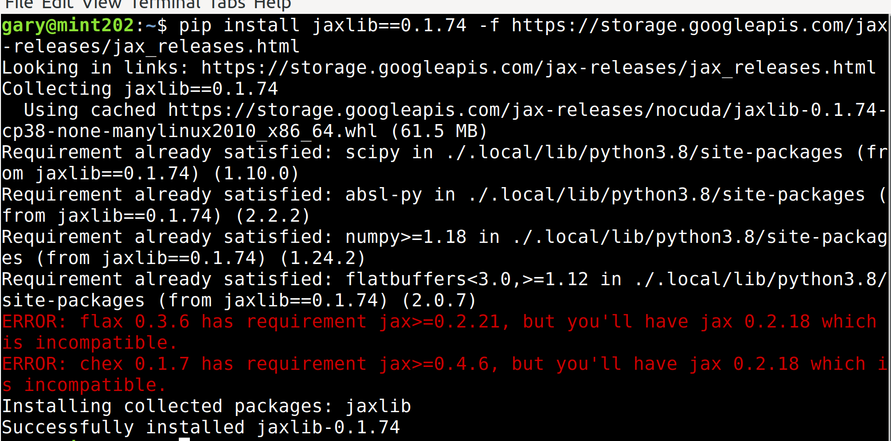 

__Install mpi4py__

If the module mpi4py is included in the requirements.txt list, it will install smoothly initially, but it will get kicked out later, before the end of the installation fest, and in such a way that it can't be re-installed directly. I took a hint from Stack Overflow question 28440834 to dodge this _contretemps_, first installing the dev version of Open MPI, and then installing mpi4py without specifying a desired version. (It installed version 4.0.3).

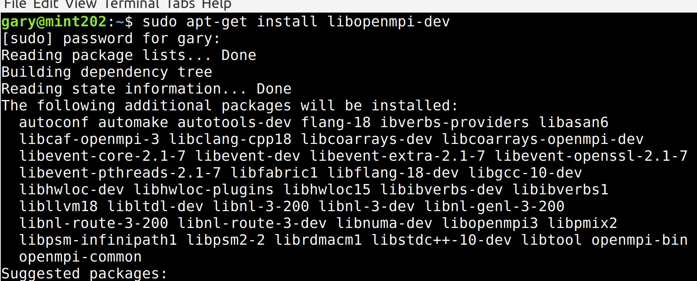

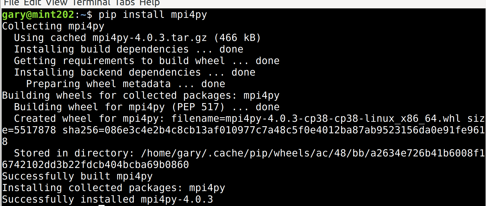

__Download the VMC_PDE Code__

Download the __vmc_pde__ sample problem code and extract it into a directory.

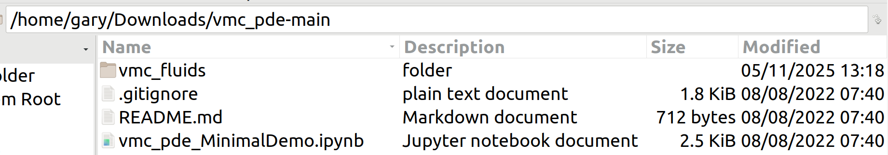

__Install the Python IDE IDLE__

To get a quick look at the viability of the code execution machinery, use apt to install the Idle program.

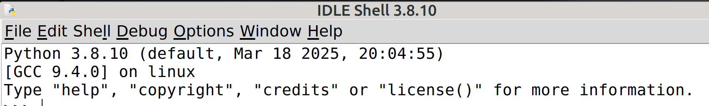

__Test the Sample Code__

Directly test the sample problem using Idle. Open the main.py module, located within the __vmc_fluids__ directory, and run it. The data, tables, and all 19 figures should be generated. The first six figures are rendered one at a time, and it is up to the user to save or discard them before the program continues. After having demonstrated that the code is viable, you can move on to testing the functionality of the Jupyter version.

__Edit the PATH__

In the home directory there is a file called .bashrc. It is necessary to edit this file to get permanent effective change in the $PATH. The permanent change that is desired is access to some designated import directory, which can hold the modules that the application will need to import as ancillaries. At the very end of the file place a $PATH change statement similar to the one shown on the last line of the image below.

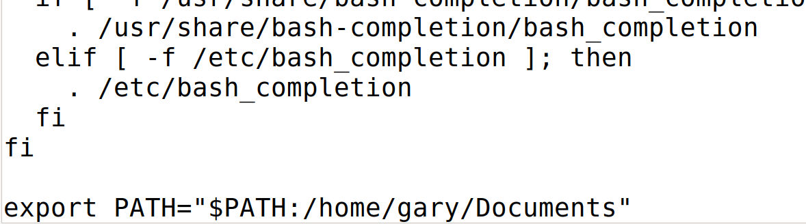

__Test Jupyter Rendition__

The target directory that was the subject of the $PATH statement in the .bashrc file should be augmented to contain the 14 .py files that are located in the __vmc_fluids__ directory of the __vmc_pde__ code folder, plus a sample notebook file with a cell containing the main.py code. Right click on this target directory, open a terminal, and start the Jupyter notebook from there. Open a notebook file and execute the critical cell. All the output for the sample problem that was shown in Idle should become available, though in Jupyter the figures will be generated without pauses.

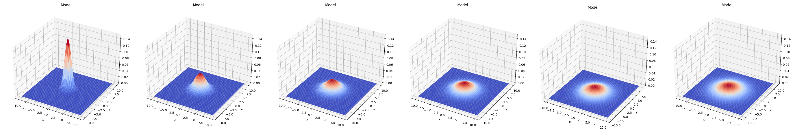

clipart credit to Jean Beaufort (publicdomainpictures.net)

Page last updated on 12 May 2025

  
